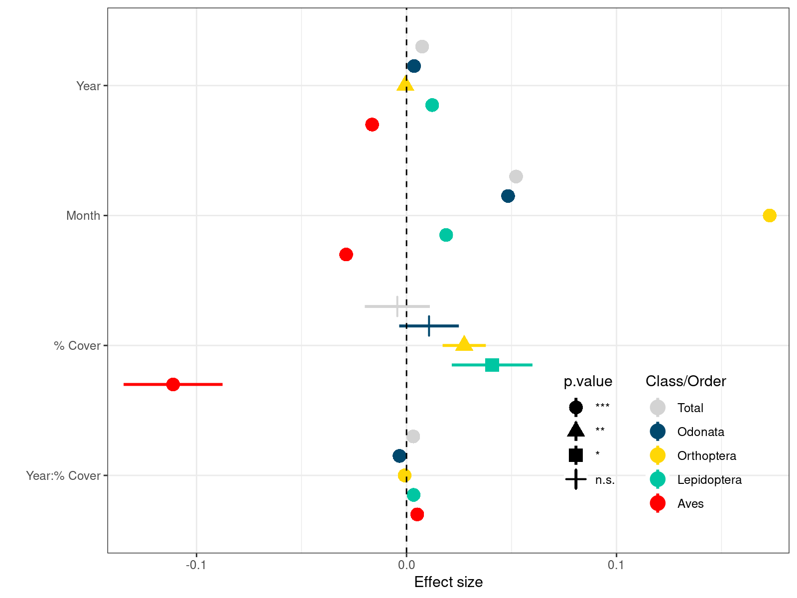
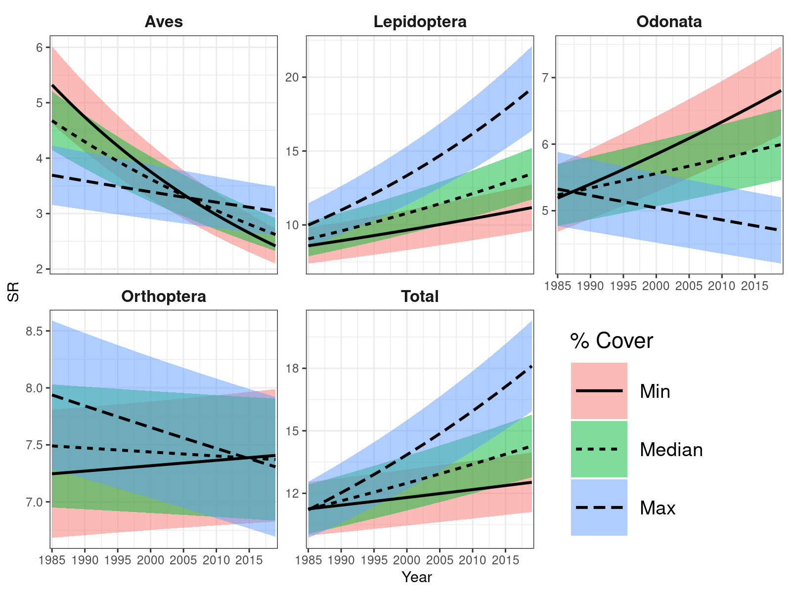

<!-- 

See ggcoefstats for nice forest plot with statistical details!!!
=> see also emmeans examples in ggstatsplot, search github repo!!!

- Sind die richness change Ergebnisse korrigiert für den observation effort?
- Ich denke, es wäre wichtig, die IUCN-Kategorien zu vermeiden und die deutschen Kategorien zu nutzen. Das könnte dann zwar etwas kleinteilig werden, aber auch aufschlussreich sein. Intuitiv würde ich auf jeden Fall die Landschaftsschutzgebiete (LSG) getrennt behandeln; außerdem würde ich FFH-/Vogelschutzgebiete als gemeinsame Kategorie nehmen, einmal mit Nationalparks und NSGs zusammen und einmal getrennt (wobei die oft auch beides sind). Schau aber mal, welche Kategorien es noch gibt und wir können dann mal überlegen, wie wir daraus eine sinnvolle Klassifizierung machen können…
- Was sind die non-designated areas?


- Add water to overall model???
- Show AIC, Adjusted R2, p-values for models! (Table 1)
- Add Main Figure on difference across Naturräume!

- Figure S4: Remove colour legend, split into two columns!
- Figure S5: Add 0 as grey background + Add outline of Bavaria! + Increase colour legend!

- Sort code into correct order and split into different Figures/Supp Figures, see Reptile1.5

- Use ggstatsplot/ggdist for Figures?

- Run multiple models (different variable combinations)
=> Create table with models against variables (p-values), Adj. R2 and AIC
=> Keep month in final model or not? (+ Filter out month == 0)

- Add water presence/lake variable to all models (significant for Odonata?)

- Check out Schafft et al. 2021 for Forest plot with mean + ci + effect as table on the side!

- Suppl: Add scale comparison (Tk4tel vs. TK25) (Ref: Chase et al. 2019 - Oikos)
- Suppl: Add time comparison => Not just upscaling, but smoothing (grainchanger)

Potential ideas:
- Change to Bayesian/Regression tree/BART model (Statistical Rethinking, stan_glmer, stan_lmer, brms: https://www.rensvandeschoot.com/tutorials/generalised-linear-models-with-brms/, ...)
- Look at non-linear relationships, plot model output/summary
- Tips on mixed effects models: Silk et al. 2020 - PeerJ
-->

<!--
**Running head:** Protected areas help to maintain Bavarian biodiversity

**Main message (in 25 words or less):** ...

## Working abstract:

**Context and aim:** Biodiversity is declining globally, but we still lack precise knowledge on regional biodiversity changes and their drivers. Here we assess a unique species occurrence data set for Bavaria and analyse species richness changes over time across four taxa (Aves, Odonata, Orthoptera and Lepidoptera). We assess how changes in species richness vary with protection to see if protected areas provide a save haven for biodiversity.

**Core results:** ...

**Interpretation in context:** ...

**Application:** ...

## Introduction

## Methods

### Species data

*  ASK data of 4 taxa (Aves, Lepidoptera, Odonata & Orthoptera)
*  Time period: 1985 - 2019

### Protected area data

* ProtectedPlanet data for Germany cropped by extent of Bavaria

### Data Analysis

*  Linear mixed effects model

*  We have dropped all data where month = 0. 
Need to consider this if month is included in the model!

## Results

## Discussion

## References
-->

## Tables

**Table 1.** Model performance (BIC) of different variable combinations for each taxon (Aves, Lepidoptera, Odonata, Orthoptera) and all taxa together (Total).

```{r, echo=F, message=FALSE, asis=T}
library(dplyr)

# Load data
load("data/df_mod_glance.rda")

# Create table
df_mod_glance %>% dplyr::select(formula, class_order, BIC) %>%
  tidyr::pivot_wider(names_from="class_order", values_from="BIC") %>%
   knitr::kable()
```

**Table 2.** Model variance (R2.var.fixed) of different variable combinations for each taxon 
(Aves, Lepidoptera, Odonata, Orthoptera) and all taxa together (Total).


```{r, echo=F, message=FALSE, asis=T}
# Load data
load("data/df_mod_var.rda")

# Create table
df_mod_var %>% dplyr::select(formula, class_order, R2.var.fixed) %>%
  mutate(R2.var.fixed = round(R2.var.fixed, digits=3)) %>%
  tidyr::pivot_wider(names_from="class_order", values_from="R2.var.fixed") %>%
  knitr::kable()
```

## Figures



**Figure 1.** Modelled mean species richness over time for min, median and max percentage cover protection split by taxonomic group (Aves, Lepidoptera, Odonata, Orthoptera and Total). <!-- Significances to labels??? -->



**Figure 2.** Modelled mean species richness over time for min, median and max percentage cover protection split by taxonomic group (Aves, Lepidoptera, Odonata, Orthoptera and Total).
