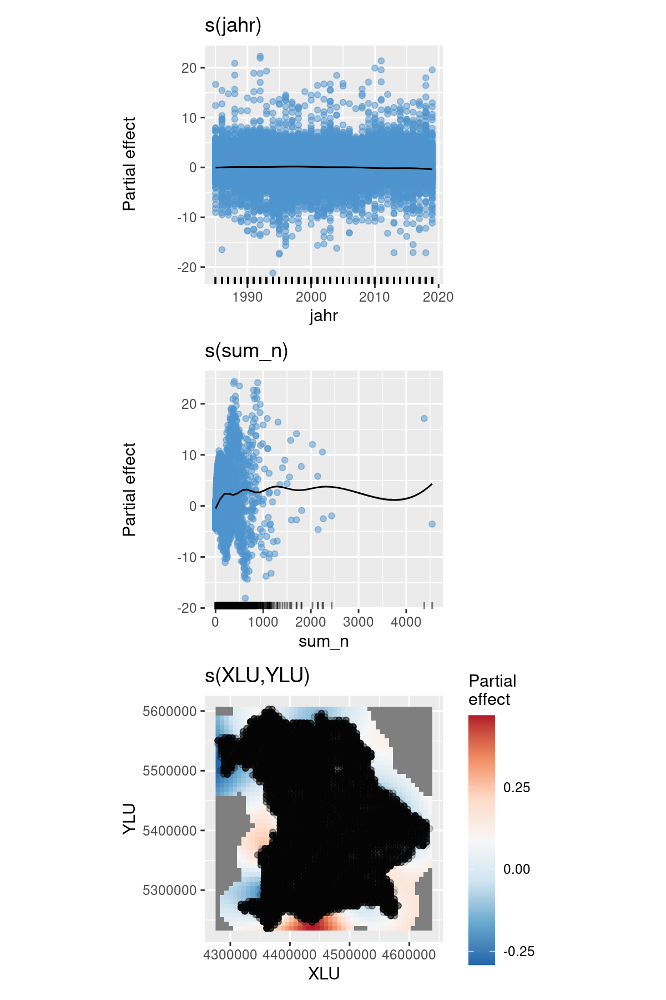

bavDiv - Species richness changes in Bavaria, Germany: Differences
between protected and non-protected areas
================

<!--
output: 
  word_document:
      reference_docx: my-styles.docx
-->
<!-- 

See ggcoefstats for nice forest plot with statistical details!!!
=> see also emmeans examples in ggstatsplot, search github repo!!!

- Ich denke, es wäre wichtig, die IUCN-Kategorien zu vermeiden und die deutschen Kategorien zu nutzen. Das könnte dann zwar etwas kleinteilig werden, aber auch aufschlussreich sein. Intuitiv würde ich auf jeden Fall die Landschaftsschutzgebiete (LSG) getrennt behandeln; außerdem würde ich FFH-/Vogelschutzgebiete als gemeinsame Kategorie nehmen, einmal mit Nationalparks und NSGs zusammen und einmal getrennt (wobei die oft auch beides sind). Schau aber mal, welche Kategorien es noch gibt und wir können dann mal überlegen, wie wir daraus eine sinnvolle Klassifizierung machen können…
- Was sind die non-designated areas?

- Show AIC, Adjusted R2, p-values for models! (Table 1)

- Figure S4: Remove colour legend, split into two columns!
- Figure S5: Add 0 as grey background + Add outline of Bavaria! + Increase colour legend!

- Sort code into correct order and split into different Figures/Supp Figures, see Reptile1.5

- Use ggstatsplot/ggdist for Figures?

- Run multiple models (different variable combinations)
=> Create table with models against variables (p-values), Adj. R2 and AIC
=> Keep month in final model or not? (+ Filter out month == 0)

- Check out Schafft et al. 2021 for Forest plot with mean + ci + effect as table on the side!

- Suppl: Add scale comparison (Tk4tel vs. TK25) (Ref: Chase et al. 2019 - Oikos)
- Suppl: Add time comparison => Not just upscaling, but smoothing (grainchanger)

Potential ideas:
- Change to Bayesian/Regression tree/BART model (Statistical Rethinking, stan_glmer, stan_lmer, brms: https://www.rensvandeschoot.com/tutorials/generalised-linear-models-with-brms/, ...)
- Look at non-linear relationships, plot model output/summary
- Tips on mixed effects models: Silk et al. 2020 - PeerJ
-->
<!--
**Running head:** Protected areas help to maintain Bavarian biodiversity

**Main message (in 25 words or less):** ...

## Abstract:

**Aim:** Biodiversity is declining globally, but we still lack precise knowledge on regional biodiversity changes and their drivers.

**Location:** Bavaria, Germany, central Europe

**Time period:** 1989-2019

**Major taxa studied:** Aves, Lepidoptera, Odonata, Orthoptera

**Methods:** Here we assess a unique species occurrence data set for Bavaria and analyse species richness changes over time across four taxa (Aves, Odonata, Orthoptera and Lepidoptera). We assess how changes in species richness vary with protection to see if protected areas provide a save haven for biodiversity.

**Results:**

**Main conclusions:**

**KEYWORDS:** biodiversity, insect, lepidoptera, orthoptera, odonata, time series, conservation, protection, europe

## Introduction

## Methods

### Species data

*  ASK data of 4 taxa (Aves, Lepidoptera, Odonata & Orthoptera)
*  Time period: 1985 - 2019

### Protected area data

* ProtectedPlanet data for Germany cropped by extent of Bavaria

### Data Analysis

*  Linear mixed effects model

*  We have dropped all data where month = 0. 
Need to consider this if month is included in the model!

## Results

## Discussion

## Conclusion

## References

## Data Accessibility Statement

The ASK database is not publicly available, but has been kindly provided by the Bavarian State Agency for the Environment (Bayerisches Landesamt für Umwelt, LfU). The code and summarised data used for the performed data analysis and the presented figures, can be found at https://github.com/xxxx/xxxx.
-->

## Tables

**Table 1.** Model performance (BIC) of different variable combinations
for each taxon (Aves, Lepidoptera, Odonata, Orthoptera) and all taxa
together (Total).

| formula                                               |     Aves | Lepidoptera |  Odonata | Orthoptera |    Total |
|:------------------------------------------------------|---------:|------------:|---------:|-----------:|---------:|
| sum_art \~ s(jahr) + s(sum_n)                         | 146364.8 |    252721.6 | 61695.34 |   64640.47 | 487483.4 |
| sum_art \~ s(jahr) + s(XLU) + s(YLU) + s(sum_n)       | 145439.5 |    249448.7 | 61483.04 |   64149.92 | 481724.3 |
| sum_art \~ s(jahr) + s(XLU, YLU) + s(sum_n)           | 145159.7 |    244228.6 | 61459.43 |   64102.48 | 475467.1 |
| sum_art \~ mon + s(jahr) + s(sum_n)                   | 129356.8 |    312108.6 | 79512.01 |   77502.65 | 717109.9 |
| sum_art \~ mon + s(jahr) + s(XLU) + s(YLU) + s(sum_n) | 128904.3 |    308684.6 | 79460.11 |   77311.58 | 713027.6 |
| sum_art \~ mon + s(jahr) + s(XLU, YLU) + s(sum_n)     | 128880.9 |    304120.0 | 79451.93 |   77313.70 | 706953.7 |

**Table 2.** Model variance (R2) of different variable combinations for
each taxon (Aves, Lepidoptera, Odonata, Orthoptera) and all taxa
together (Total).

| formula                                               |  Aves | Lepidoptera | Odonata | Orthoptera | Total |
|:------------------------------------------------------|------:|------------:|--------:|-----------:|------:|
| sum_art \~ s(jahr) + s(sum_n)                         | 0.765 |       0.704 |   0.716 |      0.679 | 0.659 |
| sum_art \~ s(jahr) + s(XLU) + s(YLU) + s(sum_n)       | 0.768 |       0.714 |   0.724 |      0.696 | 0.665 |
| sum_art \~ s(jahr) + s(XLU, YLU) + s(sum_n)           | 0.770 |       0.733 |   0.726 |      0.701 | 0.681 |
| sum_art \~ mon + s(jahr) + s(sum_n)                   | 0.744 |       0.698 |   0.751 |      0.738 | 0.588 |
| sum_art \~ mon + s(jahr) + s(XLU) + s(YLU) + s(sum_n) | 0.752 |       0.716 |   0.757 |      0.747 | 0.604 |
| sum_art \~ mon + s(jahr) + s(XLU, YLU) + s(sum_n)     | 0.752 |       0.735 |   0.760 |      0.750 | 0.625 |

## Figures

**Figure 1.** a) Number of observations recorded per year, b) number of
observations per grid cell, c) Species richness recorded per year, d)
Species richness per grid cell. Different colours represent number of
species per taxonomic group.

**Figure 2.** Generalized additive model (GAM) plots showing the partial
effects on total species richness. Tick marks on the x-axis are observed
data points. The y-axis represents the effect function of isolation on
Kipp’s distance. Dark gray shadows indicate 95% confidence bounds. (Note
that the scale of the y-axis differs between the two columns).

**Figure 3.** Observed and modeled species richness over time for three
randomly selected sites. Modeled species richness was predicted for a
sampling effort of N = 500.

**Figure 4.** a) past (1985) and b) present (2018) modeled species
richness, as well as the mean modeled species richness over time for
Bavaria. Modeled species richness was predicted for a sampling effort of
N = 500.

**Figure 5.** Map of percentage cover per grid cell for the different
IUCN protection categories.

**Figure 6.** Randomly sampled locations with sufficient observations (N
\>= 20) for non-protected grid cells (Protection \< 20 %, N = 68, black)
and protected grid cells (Protection \>= 20 %, N = 68) for each IUCN
category present (II, III-V, V and Not-Reported, N = 17).

**Figure 7.** Plot of species richness over time separately for each
taxonomic group and for protected versus non-protected areas.

**Figure 8.** Plot of species richness, sampling effort and species
richness/sampling effort over time for protected areas divided into the
different IUCN categories.
