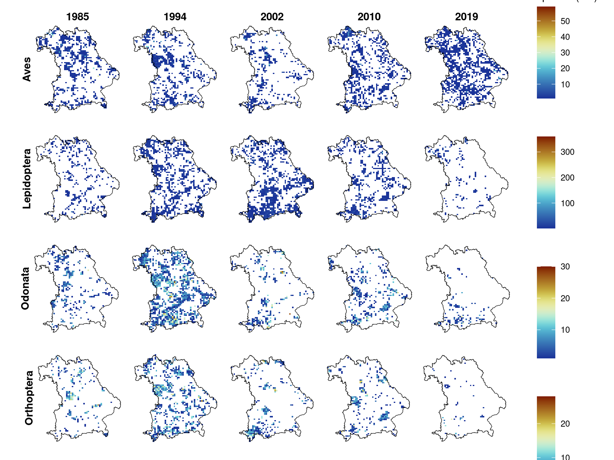

## Supporting Figures

**Supporting Figure 1.** a) Number of observations recorded per year, b) number of observations per grid cell, c) Species richness recorded per year, d) Species richness per grid cell. Different colours represent number of species per taxonomic group.

**Supporting Figure 2.** Relationship between number of observations (sqrt-transformed) and the number of species observed per grid cell.

**Supporting Figure 3.** Relationship between mean number of species (weighted by the number of observations) and the year of observation. Size of the points reflects the total number of observations.
<!-- Add plot of richness against months -->

**Supporting Figure 4.** Number of species (sr) per grid cell for the different taxonomic groups (Aves, Lepidoptera, Odonata & Orthoptera) for selected years (1985, 1994, 2002, 2010, 2019).

**Supporting Figure 5.** Relationship between mean number of species (weighted by the number of observations) and the month of observation. Size of the points reflects the total number of observations.

#' **Supporting Figure 6.** Relationship between number of species per month & year. Size of the points reflects the total number of observations.

**Supporting Figure 7.** Map of Naturräume.

**Supporting Figure 8.** Variation in species richness across the different Naturraeume.

**Supporting Figure 9.** Map of percentage coverage of rivers and lakes.

**Supporting Figure 10.** Species richness against water coverage.

**Supporting Figure 11.** Map of percentage cover per grid cell for the different IUCN protection categories.

**Supporting Figure 12.** Variation in species richness across percentage coverage considering all IUCN protection categories together.

**Supporting Figure 13.** Variation in species richness across percentage coverage and different IUCN protection classes.

**Supporting Figure 14.** Plot of species richness over time separately for each taxonomic group and for different protection coverage classes (0-25 %, 25-50%, 50-75%, 75-100%) as well as different IUCN categories.

**Supporting Figure 15.** Effect sizes of generalized linear mixed effects model of species richness on a rough grid (TK25).  <!-- Significances to labels??? -->

**Supporting Figure 16.** Modelled change in species richness over time for min, median and max percentage cover protection on a rough grid (TK25).

**Supporting Figure 17.** a) Number of observations recorded per year, b) number of observations per grid cell, c) Species richness recorded per year, d) Species richness per grid cell for both the ASK & Ornitho database. Different colours represent number of species per taxonomic group.

**Supporting Figure 18.** Effect sizes of generalized linear mixed effects model of species richness for Aves and Total using ASK only and both ASK and Ornitho data. <!-- Significances to labels??? And shape for dataset!!! -->

**Supporting Figure 19.** Modelled change in species richness over time for min, median and max percentage cover protection for Aves and Total using ASK only and both ASK and Ornitho data.
