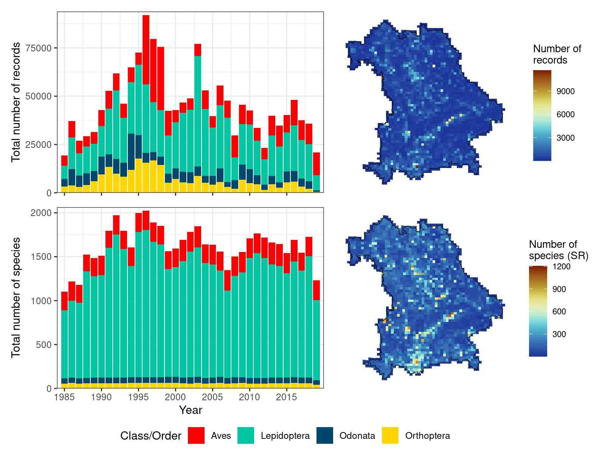

```{r setup, include=FALSE}
options(htmltools.dir.version = FALSE)
knitr::opts_chunk$set(
  fig.width=9, fig.height=3.5, fig.retina=3,
  out.width = "100%",
  cache = FALSE,
  echo = TRUE,
  message = FALSE, 
  warning = FALSE,
  hiline = TRUE
)
```

```{r xaringan-themer, include=FALSE, warning=FALSE}
library(xaringanthemer)
style_duo_accent(
  primary_color = "#1381B0",
  secondary_color = "#FF961C",
  inverse_header_color = "#FFFFFF"
)
```

## Species richness changes

---

## Protecting biodiversity

---

## Question

*  Q1: How has Bavarian species richness been changing over time?

--

* Q2: Which taxa show strongest decline in species richness

--

*  Q3: How is this change related to naturräume, protected areas and availability of water?

---

## Methods – Species Data


---

## Methods – Other Data


---

## Methods – Analysis

*  

--

* 

--

*  

--

*  

---

## Methods – Models

*  Variable Selection:
    
    - Identify possible combinations of variables with a low Pearson correlation (p < 0.7)

--

*  Identify optimal variable combination:
    
    - combination with highest accuracy (AIC)
--

*   Model algorithms:
    
    - 
---

## Results - Figure 1

```{r, echo=F, out.width = "65%", fig.align='center'}

```

---

## Results - Figure 2

```{r, echo=F, out.width = "39%", fig.align='center'}
knitr::include_graphics("figures/Figure2-1.png")
```

---

## Results - Figure 3

```{r, echo=F, out.width = "50%", fig.align='center'}

```

---

## Results - Figure 4

```{r, echo=F, out.width = "50%", fig.align='center'}
knitr::include_graphics("figures/Figure4-1.png")
```

---

## Results - Figure 5

```{r, echo=F, out.width = "62%", fig.align='center'}

```

---

## Results - Figure 6

```{r, echo=F, out.width = "65%", fig.align='center'}
knitr::include_graphics("figures/Figure6-1.png")
```

---

## Results - Figure 7

```{r, echo=F, out.width = "65%", fig.align='center'}

```

---

## Results - Figure 8

```{r, echo=F, out.width = "70%", fig.align='center'}

```

---

## Results

```{r, echo=F, out.width = "60%", fig.align='center'}
knitr::include_graphics("figures/Figure9-1.png")
```

---

## Results

```{r, echo=F, out.width = "65%", fig.align='center'}
knitr::include_graphics("figures/Figure10-1.png")
```

---

## Summary

*  Q1: ...

--

*  Q2: ...

--

*  Q3: ...

---
class: center, middle

# Thank you for your attention!

---

## Supplementary Material

```{r, echo=F, out.width = "80%", fig.align='center'}
knitr::include_graphics("figures/SupportingFigure1-1.png")
```
